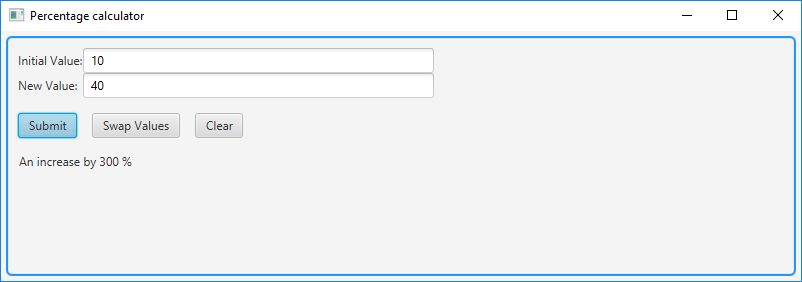
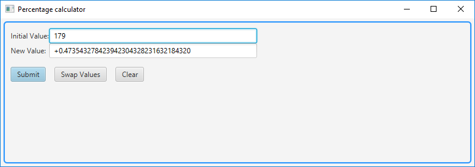
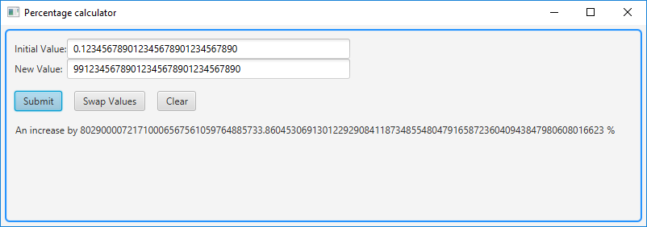
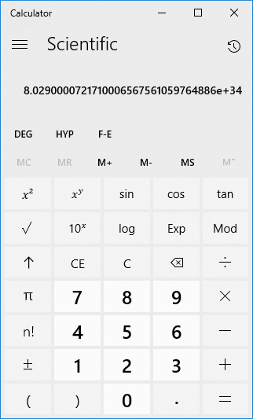
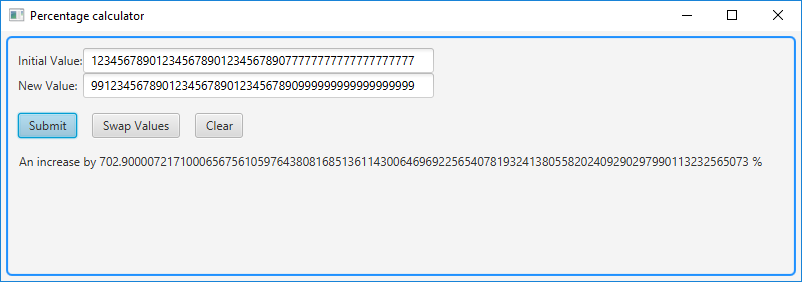

<h1>Percentage calculator using JavaFX</h1>
<h3>Introduction</h3>
This application allows a user to enter two values and obtain their difference, expressed as percentage.
  
It accepts integral and floating point numbers as input, which could be positive or negative, with up to 50 digits. It also offers high precision results.
  
The application is written using JavaFX 8, requires at least Java 8 and runs locally.
<h3>Usage examples</h3>
The user has two text input fields for the numbers and three buttons: one for submitting the form, one for swapping the two values and one to clear everything:
 
 
 
The application validates the input while the user is typing. 
  
Each input field can contain digit characters (0-9), a dot (for floating point numbers) and an optional '+' or '-' sign at the beginning. 
  
The application will not accept an initial value of zero, because it would mean that you would have to add to zero (or subtract from zero) something that is being multiplied by zero (the percentage) to obtain the other value given by the user. An alternative would have been to return a result of Infinity for the percentage in this case, but I considered more appropriate to just reject the input.
  
Input is limited to a number of 50 characters (the optional sign at the beginning is not counted). If the user exceeds the limit, the input is automatically shortened, to respect the length limit.
  
If the input becomes invalid, the text changes its color to red:
 
 
 
If the user corrects the input, its color changes to black, which indicates a valid input:
 
 
 
Now let’s use some large numbers:
 
 
 
We can verify the result by using Windows Calculator. We use this formula:
  
[ (99123456789012345678901234567890 - 0.123456789012345678901234567890) / 0.123456789012345678901234567890 ] * 100
  
We perform each operation at a time and we get this result:
 
 
 
Windows Calculator returns 8.0290000721710006567561059764886e+34, where e+34 means that we multiply the result by 10^34 (10 to the power of 34), which means that we move the floating point 34 positions to the right and we obtain the number in a more user-friendly form: 
 
80290000721710006567561059764886000 
 
Let’s put both of the results (the one from Windows Calculator and the one from my application) under each other, to compare them: 
 
80290000721710006567561059764886000
 
80290000721710006567561059764885733.86045306913012292908411873485548047916587236040943847980608016623
  
We can see that Windows Calculator performed the rounding earlier than my application did, but the results are close to each other and my application offers higher precision. 
  
Now let’s run the application using maximum allowed length numbers:
 
 
 
You cannot verify the above result by using Windows Calculator, because Windows Calculator does not accept such large numbers. I am pleased that my application offers more.
  
Now, I would like to talk a bit about the buttons of the application.
  
JavaFX allows the possibility to set a default button (a button that receives a pressed signal when the user hits Enter key) and a cancel button (a button that receives a pressed signal when the user hits Esc key). This application uses the "Submit" button as default button and the "Clear" button as cancel button. Because it was set as default button, the "Submit" button was automatically given a different color.
  
JavaFX also allows setting mnemonics for buttons. That way, you can push an application button by pressing Alt + a mnemonic key.
  
If you press Alt key inside my application, you will see that some letters on the buttons are getting underlined. Those letters indicate the mnemonics.
  
&nbsp;&nbsp;&nbsp; Alt + S will push the "Submit" button.
 
&nbsp;&nbsp;&nbsp; Alt + W will push the "Swap Values" button.
 
&nbsp;&nbsp;&nbsp; Alt + C will push the "Clear" button.
  
These key combinations are customized inside the application’s code.
  
Another important thing about JavaFX buttons: if you have focus on them and you want to press them using the keyboard, you have to use Spacebar key. This is JavaFX standard behavior.
  
Here, you can see the mnemonics set for the buttons:
 
 
 
<h3>How to run the application</h3>
You can run this application in multiple ways: 
1) From a Development Environment; 
2) From command line interface; 
3) Using executable JAR file (included in the GitHub Release, together with instructions on how to use it).
  
This application was developed under Windows 10, using Eclipse Neon.3 (which comes with Java 8), with e(fx)clipse plugin installed (using "Help -> Install New Software" Eclipse menu option).
 I used a default Java Project wizard, because the JavaFX Project wizard was automatically generating some code and creating a CSS file that I did not need for this particular application.
 The program can be run from Eclipse using the classic "Run As -> Java Application" option.
  
The application can also be compiled and run from the command line, assuming you have at least JDK 8 installed and added to Path variable.
  
Example:
 
D:\Test>javac PercentageCalculator.java -d .
 
D:\Test>java javafxpercentagecalculator.PercentageCalculator
  
Optionally, you can run this application by using the provided executable JAR file. You will still need to have at least Java 8 installed.
<h3>The reason for creating this application</h3>
Whenever I was interested in a computer upgrade, I used to compare benchmarks for processors and video cards, usually by using sites where those components were rated using numbers.
  
I know that computer benchmarks are not always reliable, since some components are more suitable for certain types of applications and there are cases when some higher rank components may be overpassed by lower rank components that behave better when running some particular application.
  
But I still wanted to compare their general ratings and see the difference between them expressed as percentage.
  
Some benchmarks sites give you the possibility to see differences as percentages, but there was a particular site that sometimes used to automatically swap my values and instead of telling me how much better would a new video card be compared to the one I already had, it told me how weaker my current video card was compared to the one I was interested in buying.
  
And just because value A is X % greater than value B does not mean that B is X % lower than A.
  
For example, if you compare value "4" to "1", what you get is a decrease of 75% from 4 to 1.
  
That is: 4 – 75 % out of 4 = 1.
  
If you go from value "1" to "4", you get a 300 % increase.
 
That is: 1 + 300% out of 1 = 4.
  
As you can see, in the first case we have a 75% difference, and the other way we have a 300% difference.
  
So, it was important for me to be able to establish which was the base value when I needed a difference as percentage. And this is why I decided to make my own percentage calculator. I also included an option that allows the user to manually swap the values when wanting to calculate the percentage the other way around.
<h3>Decisions taken during the development and the reasons behind them</h3>
Although what I needed was to compare two positive integral values, I decided to write a program that more people could use, so the final product also accepts negative numbers and floating point numbers. I also chose to offer high precision results.
  
<b>Choosing the mathematical formulas</b> 
 
Working with percentages and negative numbers was a bit of a challenge for me, as I previously only worked with percentages for positive numbers and I was not used to concepts like negative increase or negative decrease.  
  
Initially, I wanted to use a single mathematical formula and decide based on the sign of the result whether there was an increase or a decrease.
  
I started with this formula:
  
A + (X/100) * A = B, where A and B are the two values and X is their difference as percentage.
  
But then I realized I can’t simply rely on the sign of the result to tell me whether what I got was an increase or a decrease.
  
For example:
  
for A = 10 and B = 0, the result with the above formula is -100%
 
for A = -10 and B = 0, the result with the above formula is -100%
  
Practically, I got the same result, although in the first case there is a decrease (because 10>0) and in the second case there is an increase (because -10<0).
  
So, instead of relying on the sign of the result, I decided to use the comparison of the two values to establish whether there is an increase or a decrease. I also decided to use two formulas: one for the increase, and one for the decrease:
  
A + (X/100) * A = B, if A < B
 
A - (X/100) * A = B, if A > B
  
Using the two formulas above:
  
for A = 10 and B = 0, the result will be: A decrease by 100 %
 
for A = -10 and B = 0, the result will be: An increase by -100 %
  
Looks counterintuitive? Let’s verify the results:
  
First case (A = 10 and B = 0 => decrease by 100 %):
A – (X/100) * A = 10 – (100/100) * 10 = 10 – 10 = 0 = B. Correct.
  
Second case (A = -10 and B = 0 => increase by -100 %):
A + (X/100) * A = -10 + (-100/100) * (-10) = -10 + 10 = 0 = B. Correct.
  
The verification proves that the chosen formulas are correct, although negative percentages might take some time getting used to.
  
During the development of the application, I came across some UI issues that I had to solve through workarounds, because JavaFX was not powerful enough to meet my modest needs. I shall describe them, so that whoever reads my code understands how it got to look that way.
  
<b>Limiting user input to a certain length</b>
  
First of all, I needed to limit the	number of characters allowed in the input fields. Unfortunately, JavaFX does not offer such a basic option. In HTML, we have the "maxlength" attribute, but with JavaFX I had to write code that shortens the input if it exceeds a certain length.
  
Initially, I was relying on keyboard events (using setOnKeyReleased method), but then I realized that if I pasted a large text using the mouse, the text wasn’t being shortened to match the maximum allowed length, since I was relying only on keyboard events.
  
I managed to overwrite "cut" and "paste" methods for the TextField elements, so that the input would also be shortened and validated (I also implemented validation-as-you-type behavior) when the text was being changed by using mouse operations.
  
Unfortunately, the text could have also been changed using "undo" and "redo" operations, but "undo" and "redo" methods are final, and I could not overwrite them. So, had I used "undo" operation, the restored text would not have gone through the validation process.
  
So, I completely changed the approach, because I discovered that I could add a Listener to the text property of a TextField. That Listener allowed me to execute an action whenever the text in the TextField changed, and the action was being triggered as a result of both keyboard and mouse text modifications. Unfortunately, it was also being triggered by "setText" method. And I was using "setText" method when shortening the input text. 
  
More specifically: whenever the text was being modified, a Listener was being triggered. Inside the Listener, I was shortening the text (if it was too long), thus re-triggering the same Listener BEFORE it finished the initial action. I was firing a Listener inside itself.
  
I was having background exceptions, but the application was not crashing. I was however experiencing undesired functional and visual behavior, such as incorrect caret positioning after text shortening. Sometimes, after typing a character, the caret would not advance after that character and would keep its position. The result was that whenever I was typing something at the beginning or in the middle of an existing text, the rest of the text was being pushed to the right, because the caret was not advancing while typing.
  
Why was this happening? After each text modification, I was calling a method that was checking if the text exceeded the maximum length and the method was also shortening the text, if it was the case. After shortening the text (by writing a shorter text using "setText" method), the method used for limiting the length was repositioning the caret to where it initially was before shortening the text (because "setText" method would place the caret at the end). Because I was triggering a Listener inside itself, another method that was shortening the text was starting to execute before the previous resizing method got to finish. After the second execution of the resizing method was ending, the control was going back to the first execution of the same resizing method, but the re-positioning of the caret was failing, because the other resizing method changed the data.
  
So, I started looking for a way to change the text in a TextField without triggering the Listener. My search led me to a StackOverFlow page where someone else needed the same thing. An experienced user made an excellent remark, by saying "Questions like this always make me think your design is somehow wrong". I stopped looking for ways to hijack the "setText" method and I found a way to delay the resizing of the text, using "Platform.runLater" method. That way, the Listener is not being triggered inside itself anymore. That finally solved my problem.
  
All the trouble I have gone through could have been avoided, had JavaFX come with an out-of-the-box method to limit the number of characters allowed in a TextField.
  
<b>Enabling the user to copy the result</b>
  
Another problem I encountered was to display a result that could be copied by the user.
  
Since I am using high precision operations, the result can be a very long number, and the user may want to copy and paste it someplace else.
  
I was initially using a Label to display the result, but I discovered that you cannot copy the text of a Label.
  
So, instead of a Label, I chose to use a TextField and make it look like a Label (I am making its background color transparent and setting it as non-editable). That way, the result looks like an ordinary text that can be copied. 
  
<b>Choosing a data type that would offer high precision</b>
  
In the early stages of development, I was using "double" type, but soon I realized that "double" type was very far from offering me the precision I needed, so I switched to BigDecimal type.
 
For high precision, I created BigDecimal elements using BigDecimal(String) constructor. Had I used BigDecimal(double), it would have been as imprecise as double type.
   
I used a MathContext for the operations with BigDecimal, so I could define a precision and a rounding mode.
 
Rounding mode is needed to avoid endless rest from dividing (which happens for instance when you divide 1 / 3), which would result in an AritmethicException being thrown.
 
The precision is the number of digits to be used for an operation.
  
The current code uses a precision of 100 and a HALF_EVEN rounding mode (known as "Banker's rounding").
  
If you need more precision, you can change this line of code:
 
&nbsp;&nbsp; MathContext mc = new MathContext(100, RoundingMode.HALF_EVEN);
 
and replace 100 with a higher value. 
  
Note that this could cause a longer result, which might not be seen entirely in the application’s window.
 
As mentioned earlier in this document, the result is displayed inside a TextField masked as a Label, because I wanted the user to be able to copy the text of the result, and Label type was not offering this possibility. Label type however was offering the possibility to display the result on multiple lines (using "setWrapText" method), but TextField type does not offer this possibility.
 
If your result is too long and you want it displayed on multiple lines with the possibility of copying the text, you can try using a TextArea, but it is up to you to make it look like an ordinary text. You can also keep the current TextField solution which displays the result on a single line, because you have the possibility to navigate through the text if it is too long to be displayed in the window. You can go through the text using the arrow keys or Home and End keys. You can also select the whole text, using double mouse click, for example.
  
The precision from my current implementation does not lead to results too long to be displayed on one single line. All I wrote in the previous paragraph is some suggestions in case you want to modify the code and set a higher precision.
<h3>Conclusion</h3>
This document explains what this application does, how to run it, why I created it and how it technically works. It also contains programming details, so that other people could modify it easier, for their own needs.
